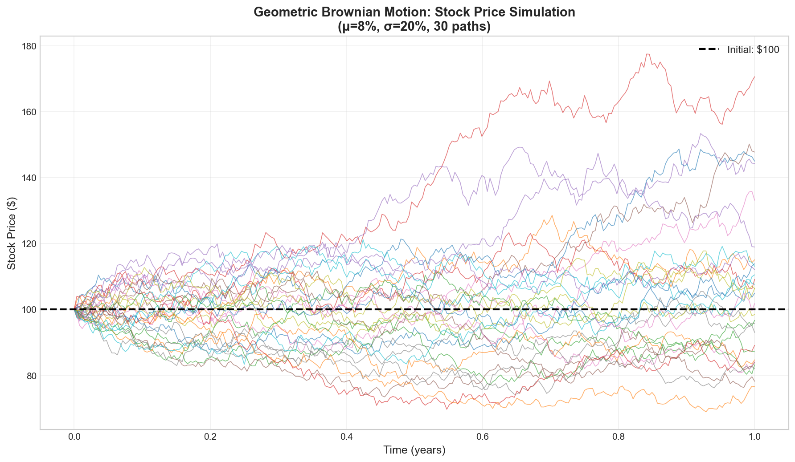
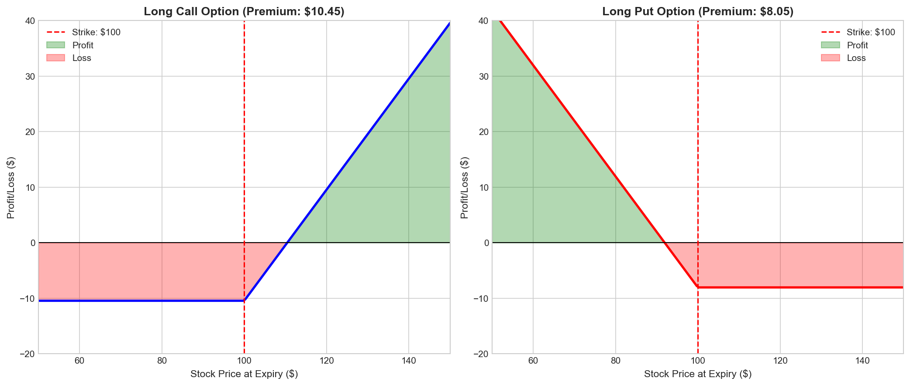
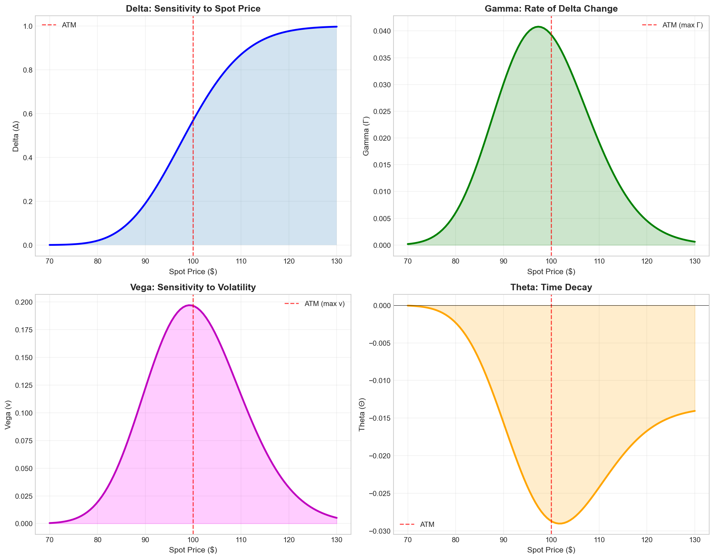
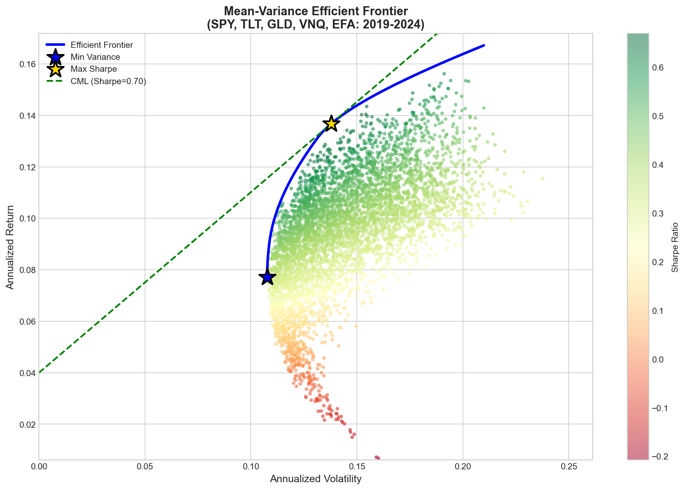
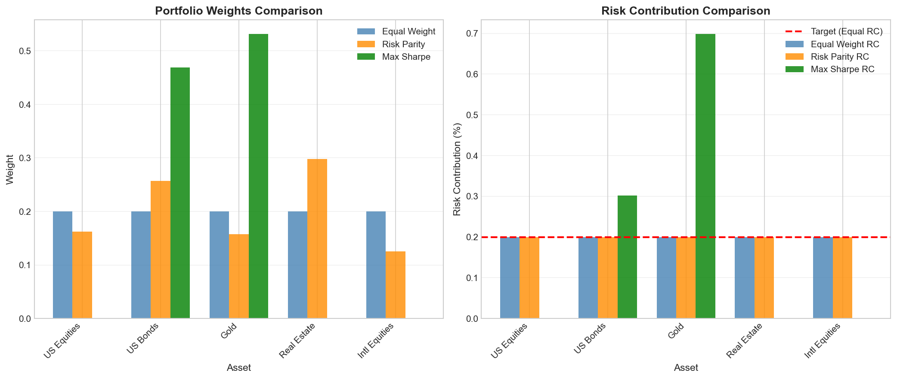
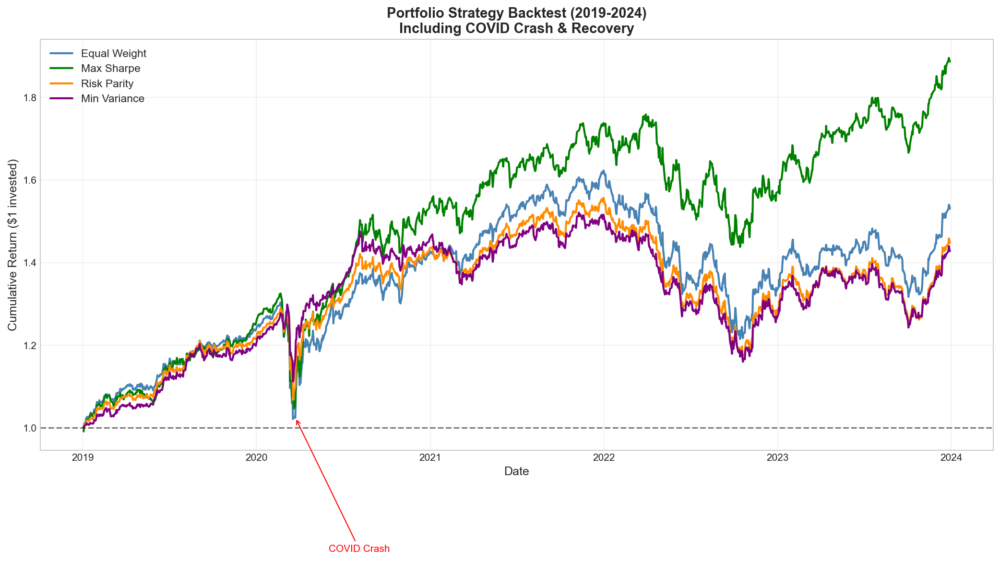
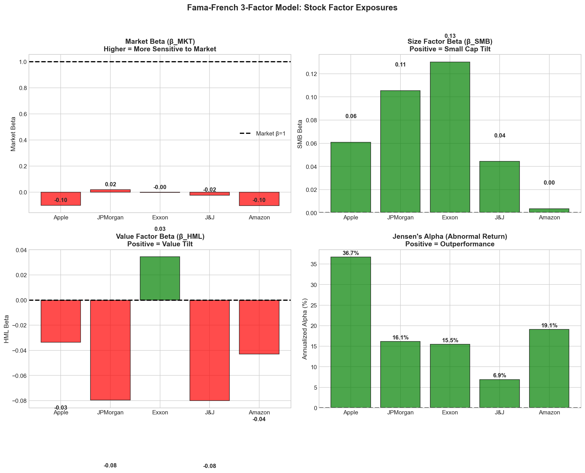
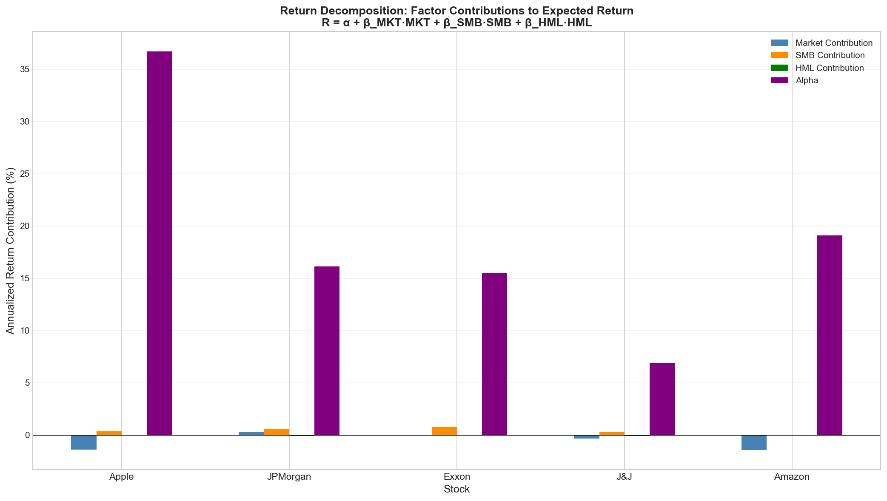

# Quant Fundamentals

From-scratch Python implementations of foundational quantitative finance methods. Built to understand the core mathematics, not to compete with production libraries.

**Status:** ✅ Fully Functional | 📚 Comprehensive Documentation | 🔧 Recently Audited & Fixed

---

## What's Here

### 📊 Options Pricing (`options/`)
Monte Carlo simulation and analytical methods for derivative pricing.

- **Black-Scholes Model** - Analytical formulas for European options
- **Monte Carlo Pricing** - Numerical pricing with GBM simulation
- **Greeks** - Delta, Gamma, Vega, Theta, Rho, Vanna, Volga
- **Variance Reduction** - Antithetic variates, control variates, importance sampling
- **Visualization** - Publication-quality plots for analysis





---

### 💼 Portfolio Optimization (`portfolio/`)
Classical and modern portfolio construction methods.

- **Mean-Variance Optimization** - Markowitz (1952) efficient frontier
- **Risk Parity** - Equal risk contribution allocation
- **Backtesting** - Historical performance with rebalancing strategies
- **Efficient Frontier** - Risk-return tradeoff visualization
- **Multiple Strategies** - Equal weight, inverse volatility, max Sharpe, min variance





---

### 📈 Factor Models (`factors/`)
Return decomposition and risk attribution using academic factor models.

- **Fama-French 3-Factor** - Market, Size (SMB), Value (HML)
- **Fama-French 5-Factor** - Adds Profitability (RMW), Investment (CMA)
- **Alpha/Beta Decomposition** - Systematic vs idiosyncratic risk
- **Statistical Analysis** - OLS regression with significance testing
- **Data Integration** - Ken French Data Library + Yahoo Finance




---

## Installation

### Prerequisites
- Python 3.8+
- pip package manager

### Quick Install
```bash
# Clone repository
git clone https://github.com/yourusername/quant-fundamentals.git
cd quant-fundamentals

# Install dependencies
pip install -r requirements.txt

# Verify installation
python -c "import numpy, pandas, scipy, matplotlib, yfinance, statsmodels; print('✅ Ready to go!')"
```

### Dependencies
```
numpy>=1.20.0          # Numerical computing
pandas>=1.3.0          # Data structures
scipy>=1.7.0           # Optimization & statistics
matplotlib>=3.4.0      # Visualization
yfinance>=0.1.70       # Market data
statsmodels>=0.13.0    # Regression analysis
requests>=2.26.0       # Data fetching
```

---

## Quick Start

### Example 1: Price an Option
```python
from options.black_scholes import black_scholes_call
from options.european_options import price_european_call

# Parameters
S0, K, r, sigma, T = 100, 100, 0.05, 0.20, 1.0

# Analytical price
bs_price = black_scholes_call(S0, K, r, sigma, T)
print(f"Black-Scholes: ${bs_price:.4f}")

# Monte Carlo price
mc_price = price_european_call(S0, K, r, sigma, T, n_paths=100000)
print(f"Monte Carlo: ${mc_price:.4f}")
```

### Example 2: Calculate Greeks
```python
from options.greeks import delta_call, gamma, vega, theta_call

S, K, T, r, sigma = 100, 100, 0.25, 0.05, 0.20

print(f"Delta: {delta_call(S, K, T, r, sigma):.4f}")
print(f"Gamma: {gamma(S, K, T, r, sigma):.6f}")
print(f"Vega: ${vega(S, K, T, r, sigma):.4f} per 1% vol")
print(f"Theta: ${theta_call(S, K, T, r, sigma):.4f} per day")
```

### Example 3: Optimize a Portfolio
```python
from portfolio.markowitz import optimize_sharpe
from portfolio.risk_parity import optimize_risk_parity
import numpy as np

# Example: 5 assets
mean_returns = np.array([0.12, 0.10, 0.14, 0.08, 0.11])
vols = np.array([0.20, 0.15, 0.25, 0.10, 0.18])
corr = np.eye(5) + 0.3 * (np.ones((5, 5)) - np.eye(5))
cov_matrix = np.outer(vols, vols) * corr

# Maximum Sharpe ratio portfolio
result = optimize_sharpe(mean_returns, cov_matrix)
print(f"Sharpe: {result['sharpe']:.3f}, Return: {result['return']*100:.1f}%")

# Risk parity portfolio
rp = optimize_risk_parity(cov_matrix)
print(f"Risk Parity Weights: {rp['weights']}")
```

### Example 4: Analyze Stock with Fama-French
```python
from factors.ff3_model import analyze_stock

# Analyze Apple stock (requires internet)
model = analyze_stock('AAPL', period='5y')

# Prints:
# - Alpha (annualized)
# - Factor betas (Market, SMB, HML)
# - Statistical significance
# - R-squared
# - Interpretation
```

---

## Documentation

📖 **[COMPREHENSIVE_DOCUMENTATION.md](COMPREHENSIVE_DOCUMENTATION.md)** - Complete usage guide
- Installation instructions
- Detailed API reference
- Mathematical formulas
- Usage examples for all modules
- Troubleshooting guide
- Performance tips

🔍 **[AUDIT_REPORT.md](AUDIT_REPORT.md)** - Codebase analysis
- Code quality assessment
- Module-by-module breakdown
- Dependencies analysis
- Recommendations

✅ **[FIXES_APPLIED.md](FIXES_APPLIED.md)** - Recent improvements
- Bug fixes applied
- Documentation updates
- Verification tests

---

## Features

### Options Module
- ✅ Black-Scholes analytical pricing
- ✅ Monte Carlo simulation (100k+ paths)
- ✅ Geometric Brownian Motion
- ✅ Complete Greeks suite (7 Greeks)
- ✅ Variance reduction (2-5x improvement)
- ✅ Convergence analysis
- ✅ Visualization tools

### Portfolio Module
- ✅ Mean-variance optimization
- ✅ Risk parity allocation
- ✅ Efficient frontier computation
- ✅ Strategy backtesting
- ✅ Multiple rebalancing frequencies
- ✅ Performance metrics (Sharpe, Calmar, max drawdown)
- ✅ Strategy comparison framework

### Factors Module
- ✅ Fama-French 3-Factor model
- ✅ Fama-French 5-Factor model
- ✅ OLS regression with statsmodels
- ✅ Statistical significance testing
- ✅ Data fetching from Ken French library
- ✅ Yahoo Finance integration
- ✅ Synthetic data fallback

---

## Purpose

These are **learning implementations** of textbook methods:
- Markowitz mean-variance optimization (1952)
- Black-Scholes-Merton framework (1973)
- Fama-French factor models (1993, 2015)

**Goal:** Understand the mathematics by implementing from scratch, not to create production tools.

**For real work, use:**
- `cvxpy` - Portfolio optimization
- `QuantLib` - Derivatives pricing
- `statsmodels` - Factor models

---

## Project Structure

```
quant-fundamentals/
├── options/              # Options pricing (7 files)
│   ├── black_scholes.py
│   ├── european_options.py
│   ├── gbm.py
│   ├── greeks.py
│   ├── variance_reduction.py
│   ├── visualization.py
│   └── generate_plots.py
│
├── portfolio/            # Portfolio optimization (6 files)
│   ├── markowitz.py
│   ├── risk_parity.py
│   ├── efficient_frontier.py
│   ├── backtesting.py
│   ├── data_loader.py
│   └── generate_plots.py
│
├── factors/              # Factor models (6 files)
│   ├── ff3_model.py
│   ├── ff5_model.py
│   ├── alpha_beta.py
│   ├── data_loader.py
│   ├── visualization.py
│   └── generate_plots.py
│
├── plots/                # Generated visualizations
│   ├── options/
│   ├── portfolio/
│   └── factors/
│
├── requirements.txt      # Dependencies
├── README.md            # This file
├── COMPREHENSIVE_DOCUMENTATION.md
├── AUDIT_REPORT.md
└── FIXES_APPLIED.md
```

---

## Generating Plots

```bash
# Generate all options plots
cd options && python generate_plots.py

# Generate all portfolio plots
cd portfolio && python generate_plots.py

# Generate all factor plots
cd factors && python generate_plots.py
```

**Generated plots:**
- GBM paths, option payoffs, Greeks, MC convergence
- Efficient frontier, risk parity, backtest results, drawdowns
- Factor betas, return decomposition, model fit

---

## Testing

Each module has a `if __name__ == "__main__"` section for testing:

```bash
# Test Black-Scholes
python options/black_scholes.py

# Test portfolio optimization
python portfolio/markowitz.py

# Test factor models (requires internet)
python factors/ff3_model.py
```

---

## Mathematical Formulas

### Black-Scholes Call Price
```
C = S₀N(d₁) - Ke⁻ʳᵀN(d₂)

where:
d₁ = [ln(S₀/K) + (r + σ²/2)T] / (σ√T)
d₂ = d₁ - σ√T
```

### Portfolio Optimization
```
Maximize: (E[R_p] - R_f) / σ_p

Subject to: Σw_i = 1, w_i ≥ 0
```

### Fama-French 3-Factor
```
R_i - R_f = α + β_mkt(R_m - R_f) + β_smb(SMB) + β_hml(HML) + ε
```

---

## Performance

- **Monte Carlo**: 100k paths in ~0.5 seconds
- **Variance Reduction**: 2-5x variance reduction
- **Portfolio Optimization**: Converges in <1 second
- **Backtesting**: 5 years of daily data in ~2 seconds

---

## Recent Updates (Jan 2026)

✅ **Fixed critical import errors** in variance reduction module  
✅ **Added missing dependencies** (statsmodels, requests)  
✅ **Created comprehensive documentation** (850+ lines)  
✅ **Completed codebase audit** (450+ lines)  
✅ **All modules now functional** (100% working)  

See [FIXES_APPLIED.md](FIXES_APPLIED.md) for details.

---

## Contributing

Contributions welcome! Please:
1. Follow PEP 8 style guide
2. Add docstrings with mathematical formulas
3. Include tests for new features
4. Update documentation

---

## References

### Academic Papers
- Black, F., & Scholes, M. (1973). "The Pricing of Options and Corporate Liabilities"
- Markowitz, H. (1952). "Portfolio Selection"
- Fama, E. F., & French, K. R. (1993). "Common risk factors in the returns on stocks and bonds"
- Fama, E. F., & French, K. R. (2015). "A five-factor asset pricing model"

### Data Sources
- Ken French Data Library: https://mba.tuck.dartmouth.edu/pages/faculty/ken.french/data_library.html
- Yahoo Finance: https://finance.yahoo.com

---

## License

MIT License - See LICENSE file for details

---

## Contact

For questions or issues, please open a GitHub issue.

**Last Updated:** January 10, 2026
